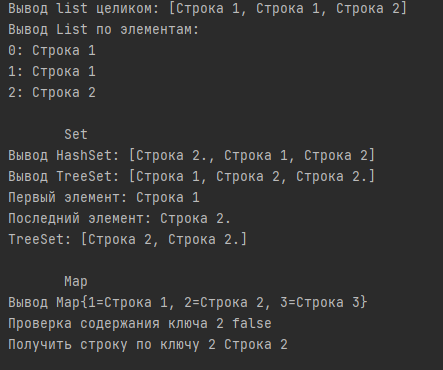

# Лабораторная работа 3

## Задание
1. Выгрузить все поля и методы класса с помощью рефлексии. Вывести на экран всех предков класса.
2. Ознакомится со всеми коллекциями java (list, set, map) и их реализацией.
3. Сделать класс и метод с дженериком.

## Разработка

### Задание 1

Для получения и вывода информации о полях, методах, аннотациях, конструкторах, интерфейсах и предках класса был создан класс [``GetClassInfo``](task1/src/com/company/GetClassInfo.java). После вывода информации о классе выводится информация по его предку.

```java
public class GetClassInfo {
    public void getInfoClass(Class c) {
        System.out.println("Имя класса " + c.getName());

        Field[] fields = c.getDeclaredFields();
        System.out.println("Поля класса:");
        if (fields.length != 0)
            for (Field field : fields)
                System.out.println(field.toString());
        else System.out.println("Поля не найдены");

        Constructor[] constr = c.getDeclaredConstructors();
        System.out.println("Конструкторы класса:");
        if (constr.length != 0)
            for (Constructor cnst : constr)
                System.out.println(cnst.toString());
        else System.out.println("Конструкторы не найдены");

        Class[] interfaces = c.getInterfaces();
        System.out.println("Интерфейсы классов:");
        if (interfaces.length != 0)
            for (Class i : interfaces)
                System.out.println(i.toString());
        else System.out.println("Интерфейсы не найдены");

        Method[] methods = c.getDeclaredMethods();
        System.out.println("Методы класса:");
        if (methods.length != 0)
            for (Method method : methods)
                System.out.println(method.toString());
        else System.out.println("Методы не найдены");

        Annotation[] an = c.getAnnotations();
        System.out.println("Аннотаци класса:");
        if (an.length != 0) {
            for (Annotation a : an)
                System.out.println(a.toString());
        }
        else System.out.println("Аннотации не найдены");

        Class parents = c.getSuperclass();
        System.out.println("Предки класса:");
        if (parents != null) {
            System.out.println(parents.getName() +"\n");
            getInfoClass(parents);
        }
        else System.out.println("Предки не найдены\n");
    }
}
```
### Задание 2
Класс [``TestCollection``](task2/src/com/company/TestCollection.java)

```java
public class TestCollection {

    public static void main(String[] args) {
        System.out.println("       List");
        List<String> list = new ArrayList<>();
        list.add("Строка 1");
        list.add("Строка 1");
        list.add("Строка 2");
        System.out.println("Вывод list целиком: " + list);
        System.out.println("Вывод List по элементам:");
        for (int i = 0; i < list.size(); i++)
            System.out.println(i+": "+list.get(i));
        System.out.println();

        System.out.println("       Set");
        Set<String> hashSet = new HashSet<>();
        hashSet.add("Строка 1");
        hashSet.add("Строка 1");
        hashSet.add("Строка 2");
        hashSet.add("Строка 2.");
        System.out.println("Вывод HashSet: " + hashSet);
        TreeSet<String> treeSet = new TreeSet<>();
        treeSet.add("Строка 1");
        treeSet.add("Строка 1");
        treeSet.add("Строка 2");
        treeSet.add("Строка 2.");
        System.out.println("Вывод TreeSet: " + treeSet);
        System.out.println("Первый элемент: " + treeSet.first());
        System.out.println("Последний элемент: " + treeSet.last());
        treeSet.remove("Строка 1");
        System.out.println("TreeSet: " + treeSet);
        System.out.println();

        System.out.println("       Map");
        HashMap<Integer, String> hashMap = new HashMap<>();
        hashMap.put(1, "Строка 1");
        hashMap.put(2, "Строка 2");
        hashMap.put(3, "Строка 3");
        System.out.println("Вывод Map" + hashMap);
        System.out.println("Проверка содержания ключа 2 "+ hashMap.containsKey(2));
        System.out.println("Получить строку по ключу 2 " + hashMap.get(2));
        System.out.println();
    }
}
```

### Задание 3

Класс [``Generic``](task3/src/com/company/Generic.java)

```java
public class Generic {

    public static void main(String[] args) {
        List<String> list = new ArrayList<>();
        list.add("Строка 1");
        list.add("Строка 2");
        for (Object s : list) {
            System.out.println(s);
        }

        List list2 = new ArrayList();
        list2.add("Строка 1");
        list2.add(1);
        for (Object str : list2) {
            System.out.println(str);
        }

        List gList = Arrays.asList("Строка 1", "Строка 2");
        for (Object obj : gList) {
            System.out.println(Generic.<String>getValue(obj));
        }
    }

    public static <T> T getValue(Object obj) {
        return (T) obj;
    }

}
```


### Результат разработки

Результат выполнения первого задания. Частичный вывод информации о классе.


Результат выполнения второго задания.



Результат выполнения третьего задания.


### Вывод 
В результате выполнения лабораторной работы получили практические навыки работы с reflection и generic. C помощью reflection  вывели: поля, конструкторы, методы, аннотации, интерфейсы и информацию о предках класса. Ознакомились с реализацией коллекций list, set, map.
При помощи generic написали класс без использования приведений типов.

## Работа выполнена

[Ащеулов Михаил ПИМ-21](https://github.com/VergiliusAW)

[Кравцов Тимофей ПИМ-21](https://github.com/Timofey98)
